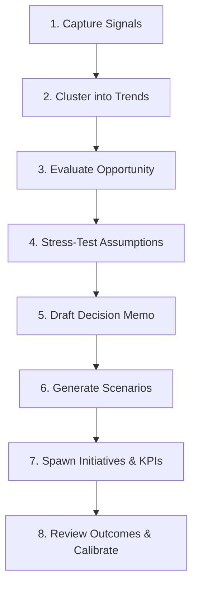

# CEO Decision Intelligence OS — User Manual & Strategic Playbook

Welcome to your **Decision Intelligence Operating System (DI-OS)**. This platform is designed to compile market signals, track strategic choices, monitor execution risks, and mathematically calibrate your forecast accuracy. It acts as an organizational brain that gets smarter over years.

---

## 1. System Components & How to Open Them

Your DI-OS is split into two interfaces: a **visual writing interface** (Obsidian) for strategic thinking, and a **command-line interface** (CLI) for running intelligence and graph algorithms.

### 1.1 The Visual Workspace: Obsidian
1. **Open Obsidian** on your computer.
2. Choose **"Open folder as vault"**.
3. Select your repository directory:
   `/Users/pratiksh/Documents/work/decision-intelligence-os/vault`
4. This vault contains all 6 layers of your system. Opening it loads your live executive cockpits, mental models, decision memos, and opportunity portfolios.

### 1.2 The Strategic CLI: Terminal
All extraction, similarity, lineage tracing, and scenario generation tools are executed via the command-line helper script:
```bash
# Navigate to project directory
cd /Users/pratiksh/Documents/work/decision-intelligence-os

# Activate the python virtual environment
source .venv/bin/activate
```

---

## 2. CLI Tooling Reference (The Commands)

The helper script `scripts/graph/graph.sh` handles graph operations.

| Command | Syntax | What it Does |
| :--- | :--- | :--- |
| **Health Check** | `./scripts/graph/graph.sh health` | Audits the vault for broken links, orphan nodes, duplicate files, and invalid schemas. |
| **Extract Graph** | `./scripts/graph/graph.sh extract` | Re-scans the vault, assigns missing IDs, and updates the JSON export files. |
| **Lineage Trace** | `./scripts/graph/graph.sh lineage [ID]` | Generates a 2-way lineage trace showing upstream signals and downstream outcomes. |
| **Similarity Match** | `./scripts/graph/graph.sh similar [ID] [TYPE]` | Finds structurally similar decisions, opportunities, or outcomes in past records. |
| **GraphRAG Search** | `python3 scripts/graph/context-packager.py --query "[Query]"` | Semantic and structural search to compile Markdown Context Packages for LLMs. |
| **Scenario Generator** | `python3 scripts/graph/generate-scenarios.py --decision [ID]` | Automatically builds 5 scenarios (Best/Worst/etc.) for any decision memo. |

---

## 3. Step-by-Step Strategic Workflow Playbook

Here is how to run the system through a typical strategic cycle: **Evaluating and launching a new product/initiative**.



### Step 1: Capture Raw Signals (`SIG`)
When you read a market survey, notice competitor feature announcements, or observe a regulatory change:
1. Create a markdown file in `vault/01-intelligence/signals/` named `SIG-2026-XXX — {slug}.md`.
2. Populate the frontmatter (leaving `entity_id` blank so it auto-populates):
   ```yaml
   ---
   entity_id: 
   entity_type: signal
   title: "Competitors Adopting E2EE"
   status: active
   source: "Tech News Announcement"
   source_quality: high
   signal_date: 2026-06-13
   created: 2026-06-13
   owner: "Founder/CEO"
   tags:
     - signal
     - competitor
   ---
   ```
3. Run extraction to register the signal:
   `./scripts/graph/graph.sh health`

### Step 2: Cluster Signals into Trends (`TRD`)
If multiple signals point to the same structural shift:
1. Create a trend note in `vault/01-intelligence/trends/` named `TRD-2026-XXX — {slug}.md`.
2. List the related signals in its frontmatter:
   ```yaml
   supporting_signals:
     - "[[SIG-2026-001]]"
     - "[[SIG-2026-002]]"
   ```

### Step 3: Score the Opportunity (`OPP`)
1. Create an opportunity note in `vault/01-intelligence/opportunities/` using the `opportunity-v2.md` template.
2. Fill out the 6-factor score (1 to 10):
   ```yaml
   score_expected_return: 8
   score_probability: 7
   score_strategic_fit: 9
   score_execution_complexity: 5
   score_resource_requirement: 4
   score_risk: 3
   ```
3. Open your **Opportunity Portfolio** dashboard in Obsidian to see it dynamically ranked against other strategic options using the live weighted scoring equation.

### Step 4: Map and Stress-Test Assumptions (`ASM`)
Every opportunity rests on falsifiable hypotheses. 
1. Create assumption notes in `vault/02-decisions/assumptions/`.
2. Link them to the opportunity:
   ```yaml
   # Inside the opportunity frontmatter
   depends_on:
     - "[[ASM-2026-001]]"
   ```
3. Challenge critical assumptions by asking: *"What if this fails or conversion rates drop 50%?"* Document the mitigations in the assumption note.

### Step 5: Draft the Decision Memo (`DEC`)
When ready to approve or reject:
1. Create a memo in `vault/02-decisions/memos/` detailing the choice, categorizing it as `reversible` or `irreversible`.
2. List the assumptions and opportunity it is based on:
   ```yaml
   related_opportunity: "[[OPP-2026-001]]"
   assumes:
     - "[[ASM-2026-001]]"
     - "[[ASM-2026-002]]"
   ```

### Step 6: Generate the Strategic Scenarios (`SCE`)
Instantly create the 5 strategic paths (Best, Base, Worst, Stretch, Black Swan) to model outcomes under variance:
1. Run the scenario engine from your terminal:
   ```bash
   ./.venv/bin/python3 scripts/graph/generate-scenarios.py --decision DEC-2026-001
   ```
2. Five scenario files will populate in `vault/02-decisions/scenarios/`. Open them to read the narratives, triggers, and capital/headcount impact tables.

### Step 7: Spawn Initiatives (`INI`) and KPIs
1. Create execution notes in `vault/03-execution/initiatives/` and `vault/03-execution/kpis/`.
2. Link them back to the decision memo to complete the lineage chain.

### Step 8: Close the Learning Loop (`OUT` & `LSN`)
When a project completes or a deadline passes:
1. Create an outcome review (`OUT-2026-XXX`) noting whether the base-case scenario occurred.
2. Write a lesson note (`LSN-2026-XXX`) detailing heuristic rules that should be added to the organizational memory (e.g. *"Okta/AD integrations are mandatory for Enterprise buyers; do not build manual key systems"*).

---

## 4. How to Use the AI Reasoning Engine (GraphRAG)

If you are using an LLM chat assistant (like Claude, ChatGPT, or Gemini) to write copy, advise on strategy, or analyze risks, you should inject the **Context Package** from the DI-OS so the AI has 100% accurate context on your startup's facts, assumptions, and history.

1. Run the **Context Packager** in your terminal with a strategic question:
   ```bash
   python3 scripts/graph/context-packager.py --query "willingness to pay premium for zero knowledge" --hops 1 --output
   ```
2. This creates a markdown package containing the exact relevant signals, assumptions, decisions, and lessons.
3. Open the generated file:
   `/Users/pratiksh/Documents/work/decision-intelligence-os/vault/06-meta-intelligence/graph/exports/context-package-willingness-to-pay-for-privacy.md`
4. Copy-paste its entire contents into your AI chat prompt, then ask:
   *"Based on this context, what pricing tiers should we launch to mitigate the risk of price-war triggers?"*

---

## 5. Operating Cadence Checklist

To keep the DI-OS compounding value, implement these three reviews:

### Daily Checklist (Triage — 5 mins)
* [ ] Open your daily inbox in `vault/00-Inbox/`.
* [ ] Convert raw notes/bookmarks into Signal files.
* [ ] Run `./scripts/graph/graph.sh health` to ensure no broken links exist.

### Weekly Review (Alignment — 15 mins)
* [ ] Open the **CEO Strategic Cockpit** (`ceo-cockpit.md`) in Obsidian.
* [ ] Audit the **Alert Center** (review any weakened assumptions or KPI misses).
* [ ] Update active forecasts (`FRC-2026-XXX`) if probabilities have shifted.

### Monthly Audit (Calibration — 30 mins)
* [ ] Resolve expired forecasts and calculate Brier Scores.
* [ ] Conduct outcome reviews for completed initiatives.
* [ ] Check the **Heuristics Queue** (lessons learned) to ensure active initiatives are complying with past heuristics.
