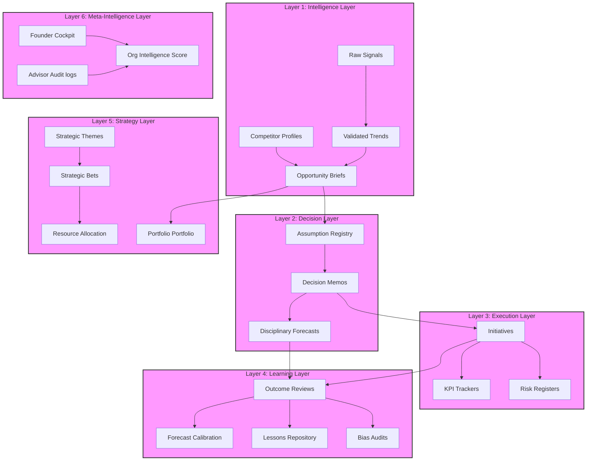
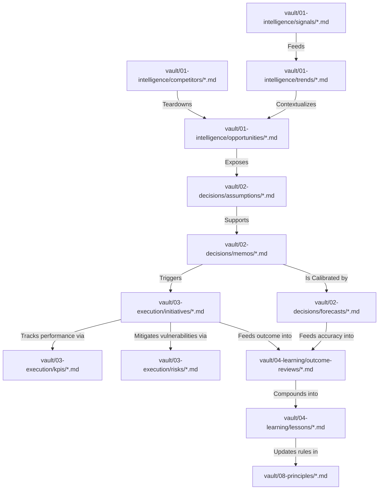
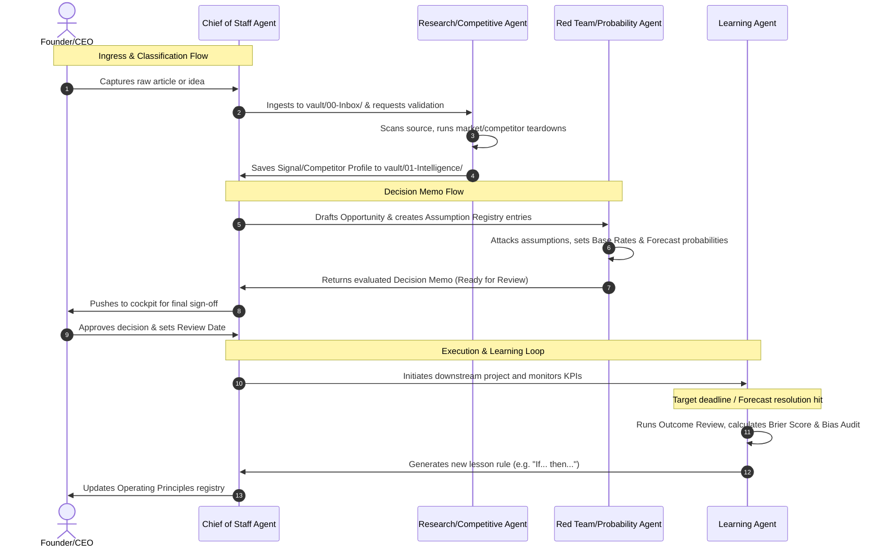

# CEO Decision Intelligence Platform
## Complete System Architecture & Implementation Specification

This document defines the production architecture, file schemas, folder structures, AI agent roles, knowledge graphs, and automation workflows for the upgraded **CEO Decision Intelligence Platform**. It is designed to compound founder intelligence over decades by closing the loop between signals, decisions, execution, and calibration.

---

## 1. Complete System Architecture (6 Intelligence Layers)

The platform is structured around six distinct intelligence layers. Each layer has specific inputs, processes, outputs, and feedback loops:



---

## 2. Directory Structure

The platform is implemented inside a markdown-native Obsidian vault with the following directory structure:

```text
decision-intelligence-os/
├── README.md
├── AGENTS.md
├── advisors/                       # AI Agent Definition Markdown Files
│   ├── chief-of-staff.md
│   ├── research-analyst.md
│   ├── competitive-analyst.md
│   ├── probability-analyst.md
│   ├── risk-analyst.md
│   ├── strategic-advisor.md
│   ├── red-team-advisor.md
│   ├── execution-advisor.md
│   ├── learning-advisor.md
│   └── portfolio-manager.md
├── workflows/                      # Active Operating Workflows
│   ├── business-opportunity-analysis.md
│   ├── decision-memo.md
│   ├── execution-planning.md
│   ├── forecasting.md
│   ├── market-intelligence.md
│   └── weekly-ceo-review.md
├── templates/                      # Obsidian Templater Files
│   ├── signal.md
│   ├── trend.md
│   ├── competitor-profile.md
│   ├── opportunity.md
│   ├── assumption.md
│   ├── decision-memo.md
│   ├── forecast.md
│   ├── initiative.md
│   ├── kpi.md
│   ├── risk.md
│   ├── outcome-review.md
│   ├── lesson.md
│   ├── forecast-calibration.md
│   ├── bias-audit.md
│   ├── strategic-theme.md
│   ├── strategic-bet.md
│   └── resource-allocation.md
├── operating-system/               # Standards and Cadence Frameworks
│   ├── confidence-framework.md
│   ├── decision-framework.md
│   ├── forecasting-framework.md
│   ├── metadata-schema.md
│   └── review-cadence.md
└── vault/                          # Master Data Vault
    ├── 00-Inbox/                   # Raw signal captures
    ├── 01-Intelligence/
    │   ├── Signals/                # Raw ingested data
    │   ├── Trends/                 # Market trends
    │   ├── Competitors/            # Competitor profiles
    │   └── Opportunities/          # Opportunities database
    ├── 02-Decisions/
    │   ├── Assumptions/            # Assumption registry
    │   ├── Memos/                  # Decision records
    │   ├── Forecasts/              # Probability estimates
    │   └── Workflows/              # Simulation logs
    ├── 03-Execution/
    │   ├── Initiatives/            # Downstream projects
    │   ├── KPIs/                   # Tracked metrics
    │   └── Risks/                  # Risk registry
    ├── 04-Learning/
    │   ├── Outcome-Reviews/        # Post-mortems
    │   ├── Lessons/                # Custom principles / rules
    │   ├── Calibration/            # Brier scorecard runs
    │   └── Bias-Audits/            # Cognitive bias reports
    ├── 05-Strategy/
    │   ├── Themes/                 # Strategic pillars
    │   ├── Bets/                   # Growth bets
    │   ├── Resources/              # Allocations ledger
    │   └── Portfolio/              # Ranked opportunity scoring
    └── 06-Meta-Intelligence/
        ├── Dashboards/             # Cockpits & dashboards
        └── Advisors/               # Prompt audits and history
```

---

## 3. Data Models & Metadata Standards

Standardized frontmatter properties enforce strict typing and make notes queryable. See [metadata-schema.md](file:///Users/pratiksh/Documents/work/decision-intelligence-os/operating-system/metadata-schema.md) for full descriptions. Below are key schemas:

### A. Signal Schema
```yaml
---
title: "Signal Name"
type: signal
status: unprocessed
created: YYYY-MM-DD HH:mm
source: "Source URL/Name"
source_date: YYYY-MM-DD
confidence_score: 1-10
importance: 1-10
related_trends: []
related_opportunities: []
tags: [signal, intelligence-layer]
---
```

### B. Trend Schema
```yaml
---
title: "Trend Name"
type: trend
status: active
created: YYYY-MM-DD
updated: YYYY-MM-DD
momentum: stable | accelerating | decelerating
confidence_score: 1-10
impact: 1-10
time_horizon: short | medium | long
related_signals: []
related_opportunities: []
tags: [trend, intelligence-layer]
---
```

### C. Opportunity Schema
```yaml
---
title: "Opportunity Name"
type: opportunity
status: draft | researching | ready-for-review | approved | rejected | monitoring
created: YYYY-MM-DD
updated: YYYY-MM-DD
market: "Market Segment"
estimated_value: 1000000
risk_level: low | medium | high
strategic_fit: 1-10
score_expected_return: 1-10
score_probability: 1-10
score_strategic_fit: 1-10
score_resource_requirement: 1-10
score_execution_complexity: 1-10
confidence_score: 1-10
source_quality: low | medium | high
evidence_strength: weak | moderate | strong
decision_readiness: research-needed | ready-for-review | ready-for-action
related_trends: []
related_competitors: []
related_decisions: []
tags: [opportunity, strategy-layer]
---
```

### D. Assumption Schema
```yaml
---
title: "Assumption Statement"
type: assumption
status: unvalidated | validated | rejected | deprecated
importance: low | medium | high
confidence_score: 1-10
owner: "Founder/CEO"
last_reviewed: YYYY-MM-DD
related_opportunities: []
related_decisions: []
tags: [assumption, decision-layer]
---
```

### E. Decision Memo Schema
```yaml
---
title: "Decision Memo Name"
type: decision
status: draft | ready-for-review | approved | rejected | monitoring | resolved
created: YYYY-MM-DD
updated: YYYY-MM-DD
review_date: YYYY-MM-DD
owner: "Founder/CEO"
confidence_score: 1-10
source_quality: low | medium | high
evidence_strength: weak | moderate | strong
decision_readiness: research-needed | ready-for-review | ready-for-action
related_opportunity: "[[Opportunity Name]]"
related_forecast: "[[Forecast Name]]"
related_initiative: "[[Initiative Name]]"
tags: [decision, decision-layer]
---
```

### F. Forecast Schema
```yaml
---
title: "Forecast Question Name"
type: forecast
status: active | resolved | archived
created: YYYY-MM-DD
updated: YYYY-MM-DD
question: "Falsifiable Forecast Question"
predicted_probability: 0.00-1.00
confidence_score: 1-10
deadline: YYYY-MM-DD
resolution_criteria: "Resolution metric definition"
actual_result: null | true | false
brier_score: null | float
related_decision: "[[Decision Memo Name]]"
tags: [forecast, decision-layer]
---
```

### G. Initiative Schema
```yaml
---
title: "Project Name"
type: initiative
status: planned | active | paused | completed | cancelled
created: YYYY-MM-DD
updated: YYYY-MM-DD
goal: "Falsifiable Goal"
owner: "Founder/CEO"
budget: 50000
expected_impact: low | medium | high
related_decision: "[[Decision Memo Name]]"
tags: [initiative, execution-layer]
---
```

### H. KPI Schema
```yaml
---
title: "Metric Name"
type: kpi
status: active
created: YYYY-MM-DD
updated: YYYY-MM-DD
target: 1000
actual: 0
trend: stable | improving | declining
related_initiative: "[[Initiative Name]]"
tags: [kpi, execution-layer]
---
```

### I. Risk Schema
```yaml
---
title: "Risk Name"
type: risk
status: active | mitigated | closed
created: YYYY-MM-DD
updated: YYYY-MM-DD
probability: low | medium | high
impact: low | medium | high
owner: "Founder/CEO"
related_decision: "[[Decision Memo Name]]"
related_initiative: "[[Initiative Name]]"
tags: [risk, execution-layer]
---
```

### J. Outcome Review Schema
```yaml
---
title: "Outcome Review Name"
type: outcome-review
created: YYYY-MM-DD
updated: YYYY-MM-DD
related_decision: "[[Decision Memo Name]]"
expected_outcome: "Outcome projected in decision memo"
actual_outcome: "Actual recorded outcome"
difference: positive | negative | neutral
tags: [outcome-review, learning-layer]
---
```

### K. Lesson Schema
```yaml
---
title: "Lesson Name"
type: lesson
category: strategic | operational | forecasting | risk
created: YYYY-MM-DD
updated: YYYY-MM-DD
trigger: "Event causing review"
tags: [lesson, learning-layer]
---
```

---

## 4. Knowledge Graph Specifications

All note templates link to each other programmatically using Obsidian wiki-style syntax. The graph has strict directional flows to prevent loops:



---

## 5. AI Agent Specifications

The platform runs on a multi-agent system composed of ten specialized agents. Complete files live in `advisors/`.

| Agent Name | Purpose | Inputs | Outputs | Decision Authority | Review Frequency |
| :--- | :--- | :--- | :--- | :--- | :--- |
| **Research Analyst** | Gather and verify market data, TAM/SAM, and user pain points. | Ingested URLs, raw signals, search engines. | Literature reviews, research briefs. | Recommends Source Quality rating. | Continuous (on signal) |
| **Competitive Analyst** | Track competitor product features, updates, pricing and threat levels. | Competitor sites, PR, update logs. | Competitor profile markdowns. | Assigns Competitor Threat Level. | Weekly & on-update |
| **Probability Analyst** | Remove forecasting biases, identify base rates, scenario probabilities. | Draft forecasts. | Calibrated probability adjustments. | Standardizes forecast Brier Scores. | Pre-decision / Resolution |
| **Risk Analyst** | Expose project failure modes, run pre-mortems, write mitigations. | Decision memos, execution drafts. | Pre-mortems, Risk Registries. | Recommends vetoes on risk criteria. | Pre-decision / Monthly |
| **Strategic Advisor** | Verify opportunities against active Strategic Themes/Bets. | Opportunities, Decision Memos. | Strategic Fit scorecards. | Recommends Portfolio ranking. | Weekly |
| **Red Team Advisor** | Critique assumptions, find confirmation bias, negate core premises. | Draft decisions, forecast inputs. | Assumption validation scorecards. | Marks assumptions "Rejected". | Pre-decision |
| **Execution Advisor** | Translate decisions to initiatives, KPIs, resource load maps. | Approved Decision Memos. | Initiatives, Milestones, KPI targets. | Flags overdue milestones. | Weekly |
| **Learning Advisor** | Audit project outcomes, calculate calibration curve and cognitive bias. | Outcome reports, resolved forecasts. | Brier scores, Bias audits, Lesson notes. | Updates Operating Principles. | Monthly |
| **Portfolio Manager** | Run weighted opportunity portfolio scorecards and frontier maps. | Opportunity portfolio list. | Portfolio matrix, ranked scorecards. | Approves composite score. | Bi-weekly |
| **Chief of Staff** | Oversee system hygiene, manage review cadence, synthesize dashboards. | Entire vault file system. | Weekly CEO Cockpit report. | Archives notes, structures priorities. | Daily |

---

## 6. Dashboard & Query Design (Obsidian Dataview)

To render real-time dashboards inside the cockpit, the platform uses Obsidian Dataview JS and standard Dataview queries.

### A. Inbox Triage Dashboard
To track incoming raw signals that require classification:
```sql
TABLE source, confidence_score, importance
FROM "vault/00-Inbox" OR "vault/01-intelligence/signals"
WHERE status = "unprocessed"
SORT created DESC
```

### B. Weighted Opportunity Portfolio Matrix
Calculates the Composite Opportunity Score using the formula:
$$\text{Composite Score} = (\text{Return} \times 0.3) + (\text{Prob} \times 0.2) + (\text{Fit} \times 0.2) - (\text{Complexity} \times 0.15) - (\text{Resources} \times 0.15)$$

```sql
TABLE market, confidence_score, estimated_value, 
  ((score_expected_return * 0.3) + (score_probability * 0.2) + (score_strategic_fit * 0.2) - (score_execution_complexity * 0.15) - (score_resource_requirement * 0.15)) AS composite_score
FROM "vault/01-intelligence/opportunities" OR "vault/05-strategy/portfolio"
WHERE status = "researching" OR status = "ready-for-review"
SORT composite_score DESC
```

### C. Active Decisions Review Schedule
Identifies decisions currently in execution that have upcoming reviews:
```sql
TABLE status, review_date, owner
FROM "vault/02-decisions/memos"
WHERE status = "monitoring" OR status = "approved"
SORT review_date ASC
```

### D. Active Forecast Trackers
```sql
TABLE question, predicted_probability, confidence_score, deadline
FROM "vault/02-decisions/forecasts"
WHERE status = "active"
SORT deadline ASC
```

### E. KPI Variance Dashboard
```sql
TABLE target, actual, (target - actual) AS variance, trend
FROM "vault/03-execution/kpis"
WHERE status = "active"
SORT (target - actual) DESC
```

---

## 7. Automation Workflows



---

## 8. Scalability Recommendations

When the Obsidian vault grows beyond **1,000+ notes**, performance can degrade due to file-system indexing and graphing overhead. Use these protocols:

1. **Tag Hierarchy Standard:** Avoid loose tags. Standardize on nested tags:
   - `#layer/intelligence/signal`
   - `#layer/decision/memo`
   - `#layer/learning/lesson`
2. **Dataview Performance Tuning:** Limit Dataview queries to specific directories. Instead of querying the entire vault `FROM ""`, always specify `FROM "vault/01-intelligence/opportunities"`.
3. **Archival System:** Once an initiative is completed and its outcome reviewed, move the note bundle to a compressed subdirectory: `vault/archive/YYYY/[note-name].md`. This reduces the active link index database size.
4. **Link Pruning:** AI agents must not generate circular links. All links must move downstream (e.g., Signal $\to$ Decision $\to$ KPI $\to$ Lesson).

---

## 9. Future Development Roadmap

### Phase 2: AI Ingress Engine (Next 6 Months)
- Integration of custom API webhooks for Slack/Telegram, allowing the founder to capture raw voice memos, notes, or links on the go.
- Natural Language Ingestion pipelines that automatically parse, summarize, and categorize incoming text using custom templates.

### Phase 3: Live Bayesian Probability Adjuster (Next 12 Months)
- Build a Python background service that parses the `vault/02-decisions/forecasts/` directory.
- Connect to Polymarket, Metaculus, and internal historical scorecards to auto-update base rates and Bayesian probabilities when new evidence is added to the log.
- Integrate automated Slack reminders for upcoming pre-mortems and outcome resolution reviews.
